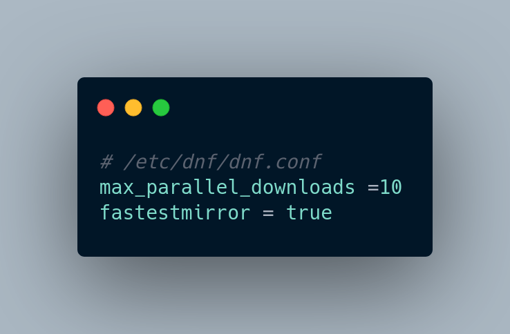
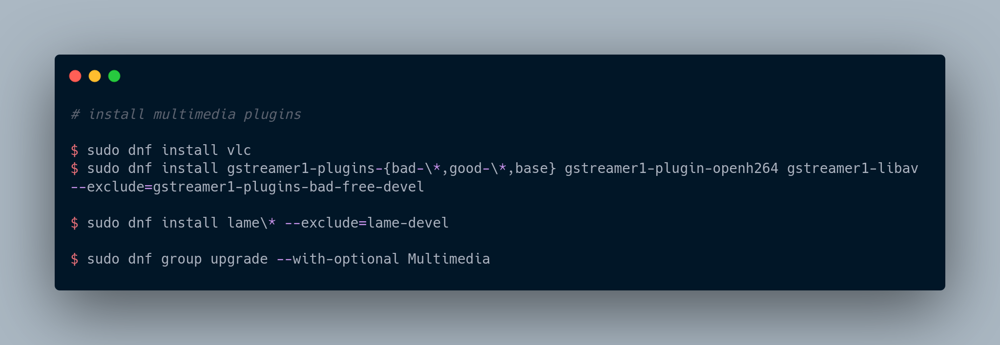
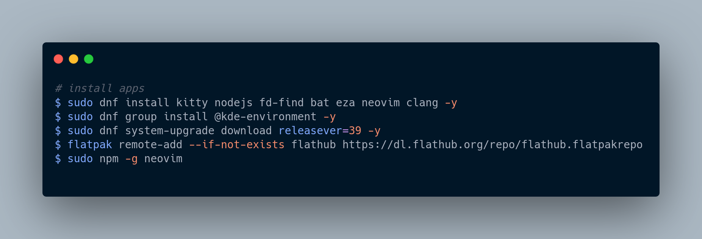

-> _These are my dotfiles, don't use it unless you know what each line of code means._

# Requirements

- Fedora 39 or insert last version

# Usage

## Post-installation guide

## Apps

- In addition, install spotify through flatpak and obs-studio through rpm fusion.
- Install [getnf](https://github.com/ronniedroid/getnf) for nerd-fonts install easily.
- Install [oh-my-zsh](https://ohmyz.sh/#install)

## Utils

- Configure [ssh-key](https://docs.github.com/en/authentication/connecting-to-github-with-ssh)
  for github authentication.
- Use DaddyTimeMono NF for usage font and CaskaydiaCove NF for code font.
- Activate night control in settings.
- Enable touchpad tap-to-click and natural scrolling in settings.

# Note

The dotfiles are in constant change. Refer to commits for old configurations.
